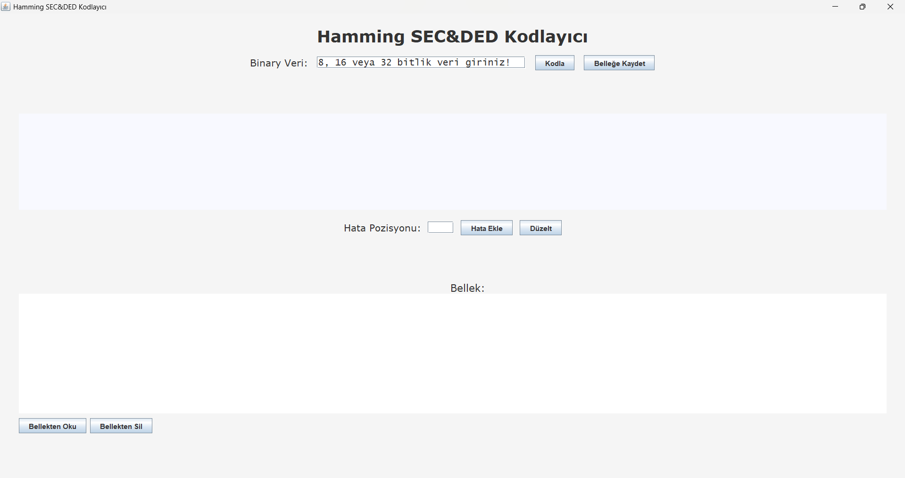
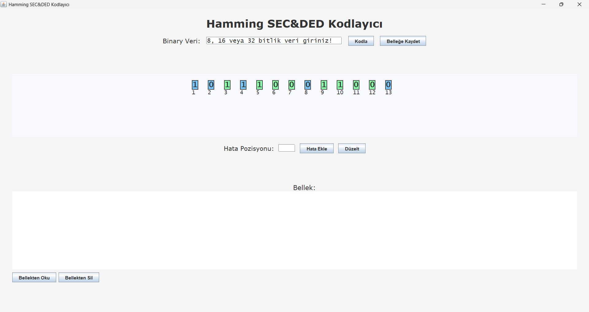
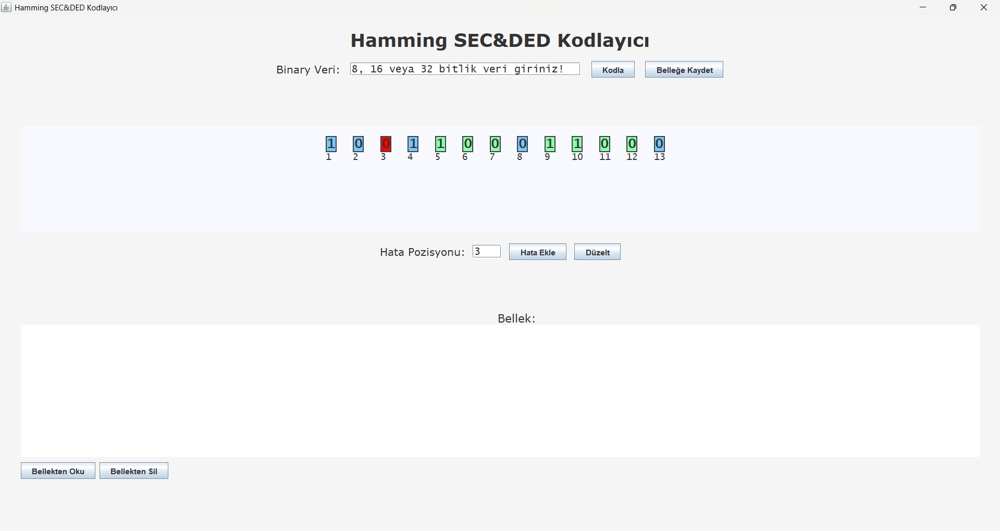
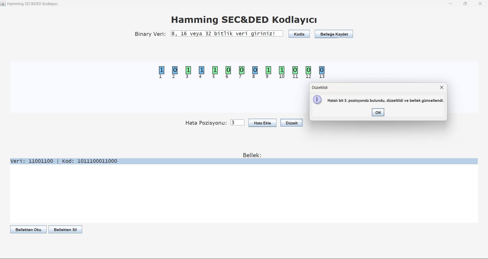

# Hamming SEC-DED Kodlayıcı

Bu projede kullanıcıdan alınan 8, 16 veya 32 bit uzunluğundaki binary veriyi **Hamming SEC-DED** algoritmasıyla kodlayan, hataları tespit edip düzeltebilen ve görsel olarak sunan bir **Java** uygulaması geliştirilmiştir.

## Özellikler

- 8, 16 ve 32 bit uzunluğunda veri giriş desteği
- Hamming SEC-DED kodlama algoritması
- Tek hata: tespit & düzeltme
- Çift hata: tespit (düzeltilemez), kullanıcıya bilgi
- Bit kutucuklarının görselleştirilmesi:
- 🟩 Veri bitleri
- 🟦 Parity bitleri
- 🟥 Hatalı bitler (tek hata)
- 🟨 Hatalı bitler (çift hata)
- Belleğe kaydetme, okuma ve silme işlemleri
- Bellekten okunan tek hatalı kodlar düzeltildiğinde otomatik güncelleme

## Arayüz Görselleri

### Başlangıç Ekranı



### Kodlama Sonrası



### Hata Ekleme Sonrası



### Hata Düzeltme Sonrası



## Derleme ve Çalıştırma

### Komut Satırı Üzerinden:

```bash
javac Hamming.java
java Hamming
```

### IDE ile:

1. `Hamming.java` dosyasını bir Java projesine ekleyin.
2. `main` metodu üzerinden çalıştırın.

## Kullanım Senaryoları

- **Kodla:** Geçerli bir binary veri girerek Hamming kodunu üretin.
- **Hata Ekle:** Belirli bir bit pozisyonuna hata ekleyin.
- **Düzelt:** Tek hata varsa düzeltin, çift hata varsa uyarı alın.
- **Belleğe Kaydet:** Hatalı veya hatasız kodları belleğe kaydedin.
- **Bellekten Oku:** Önceden kaydedilmiş bir kodu yeniden yükleyin.
- **Bellekten Sil:** Seçilen kodu bellekteki listeden kaldırın.

## Demo Videosu

**Demo Videosu:**  
[Demo Videosunu İzle](https://youtu.be/UJ86U3CJGUg?si=xuHMohJ_QUXqYSnz)

---

Bu proje **bitkicayi - Burak Ege Yaşar - tarafından** geliştirilmiştir.
